# 1 Agentforce Coworker - Ask - Agentforce Grid
Employee agent - to answer internal Salesforce users questions and act on behalf of them 
Setup can be done in less than 30min
epic.8dcb6f2d91fe@orgfarm.salesforce.com

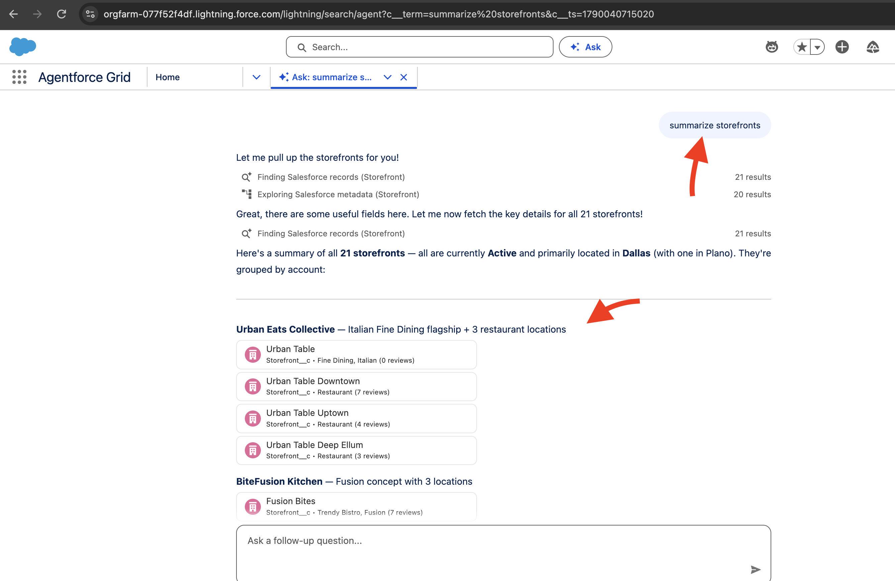
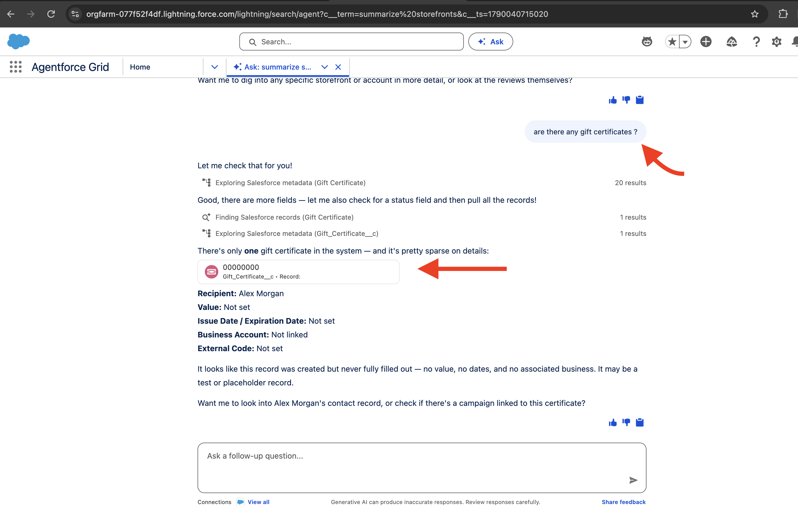

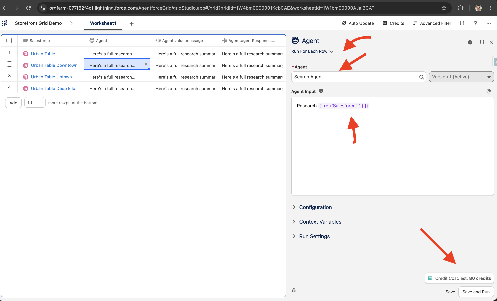

# 2 Casey the help agent
Upload your files/knowledge docs and help agent can answer questions on your site 24X7 
Setup can be done in less than 30min

epic.060da662b774@orgfarm.salesforce.com
epic.970891d2eda9@orgfarm.salesforce.com
or 
epic.a150a1b975e1@orgfarm.salesforce.com 

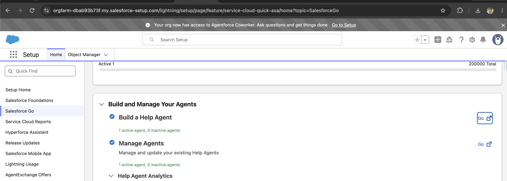
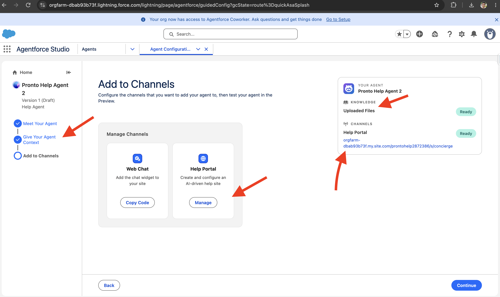
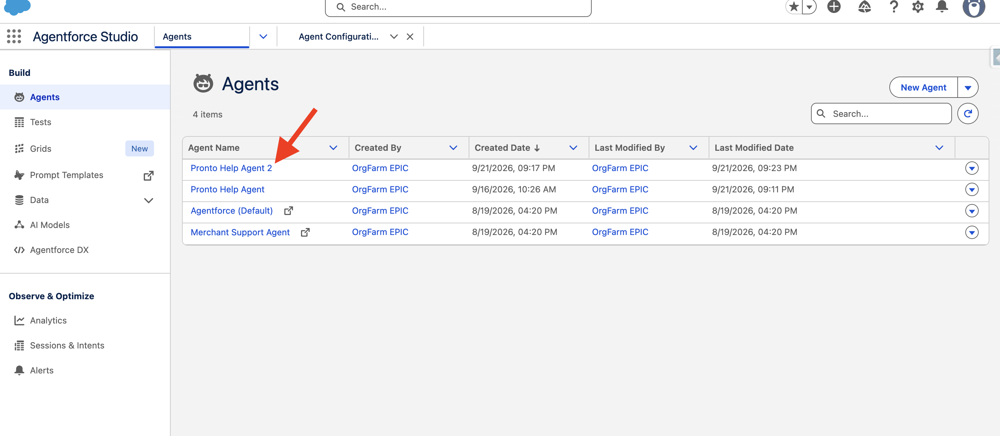

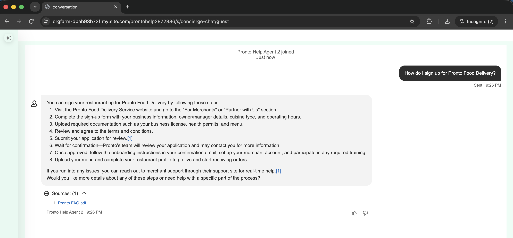

# 3 Coding Agent with AIforce - 

Connect to Salesforce client - you can use claude code, agentforce, chat gpt, cursor, teams, slack 
epic.8d89bb3e299e@orgfarm.salesforce.com
or 
epic.a507f05bbf54@orgfarm.salesforce.com 
or 
epic.40a9e34d2784@orgfarm.salesforce.com

# 4 Service Assistance - Dynamic plans 
epic.5019636a9346@orgfarm.salesforce.com
orgfarm1234

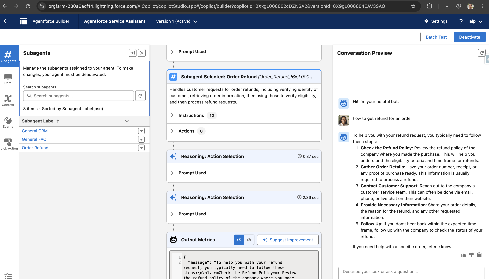
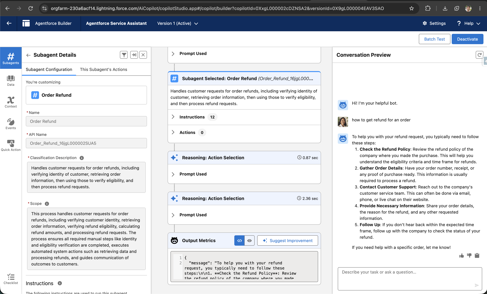
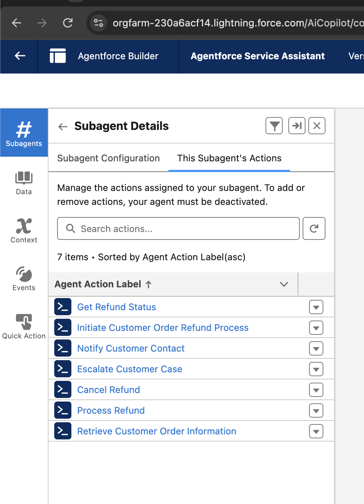

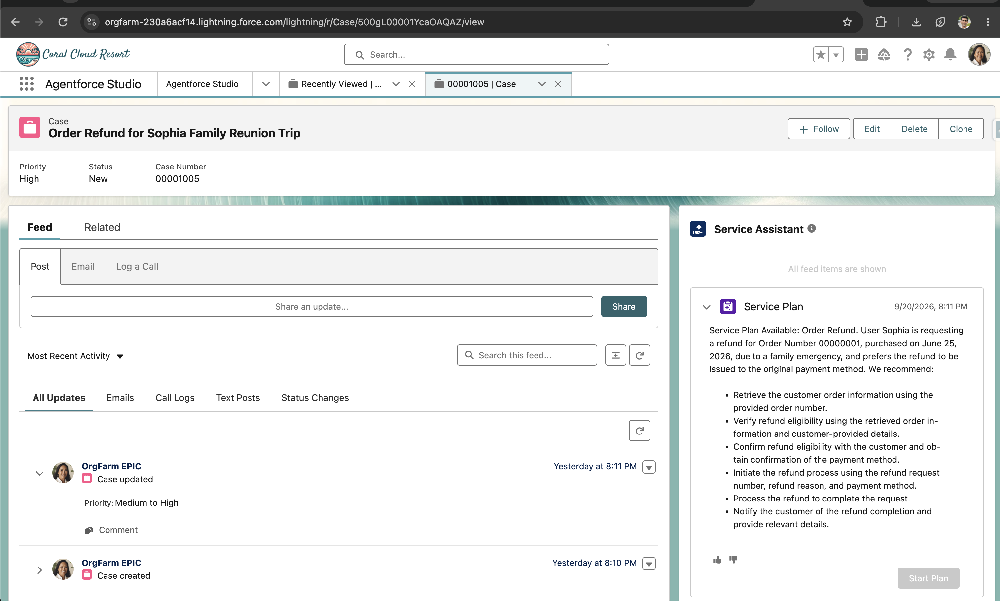
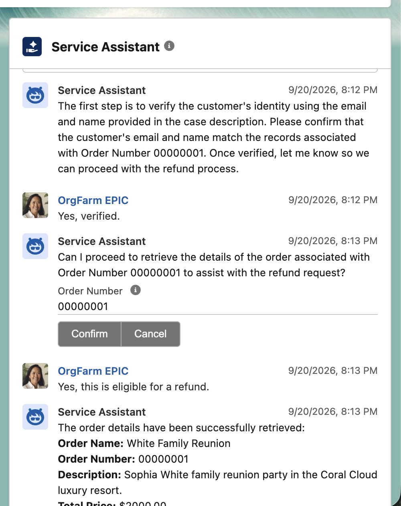
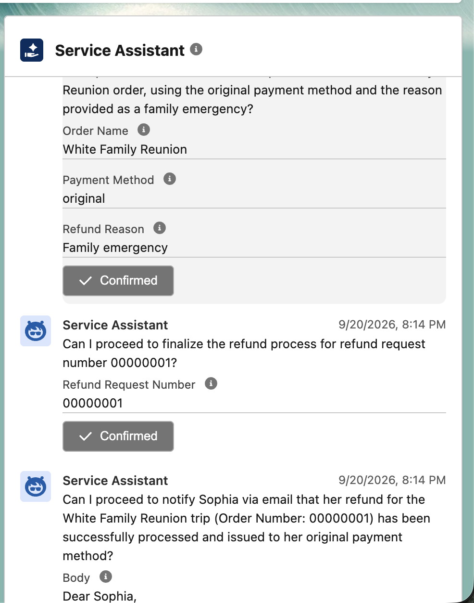
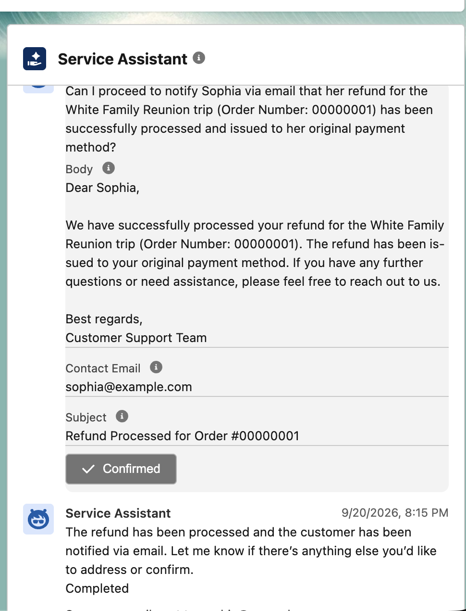

# 5 Data 360 Governance - Data privacy controls - masking 
epic.8d89bb3e299e@orgfarm.salesforce.com 
or 
epic.67aa82825cd6@orgfarm.salesforce.com

# 6 Ground Your Agentforce Agent with Enterprise Knowledge
## web content (crawler)

epic.9dc80f8c105d@orgfarm.salesforce.com
OrgClaim Code:
df4270a

# 7 Fix Salesforce Vulnerabilities
epic.bbe131382feb@orgfarm.salesforce.com
https://sfdc.co/df4272solutionguide

# 8 Multi-Agent Orchestration
epic.38d950de7a29@orgfarm.salesforce.com

https://developer.salesforce.com/workshops/

https://developer.salesforce.com/workshops/agentforce-workshop
